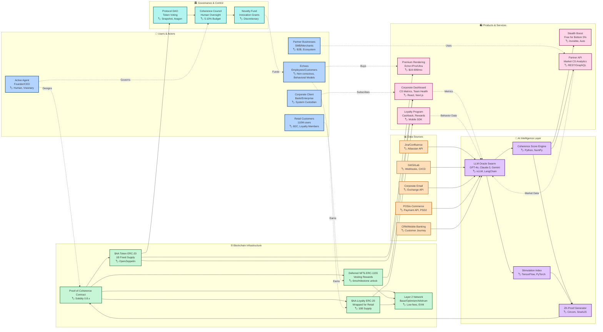

# Coherence Protocol Ecosystem - Full Architecture

## Technology Stack Summary

### Core Infrastructure
- **Blockchain**: Ethereum L2 (Base/Optimism/Arbitrum)
- **Smart Contracts**: Solidity 0.8.x, OpenZeppelin, Foundry
- **Zero-Knowledge**: Circom 2, SnarkJS, Groth16/Plonk

### AI/ML Stack
- **LLM Providers**: GPT-4o, Claude-3 Sonnet/Opus, Gemini-1.5 Pro
- **ML Frameworks**: LangChain, vLLM, Hugging Face Transformers
- **Compute**: PyTorch, TensorFlow, NumPy
- **Vector DB**: PostgreSQL + pgvector, Weaviate

### Backend Services
- **Languages**: TypeScript/Node.js, Rust, Python 3.11
- **Frameworks**: NestJS, Fastify, FastAPI
- **Databases**: PostgreSQL 16, Redis/KeyDB
- **Message Queue**: Kafka, RabbitMQ

### Frontend & Mobile
- **Web**: React 18, Next.js 14, TailwindCSS
- **Mobile**: React Native, Expo
- **UI Components**: shadcn/ui, Radix UI

### DevOps & Monitoring
- **Container**: Kubernetes 1.30, Docker
- **CI/CD**: GitHub Actions, ArgoCD
- **Monitoring**: Datadog, Prometheus + Grafana
- **Security**: HashiCorp Vault, Snyk

### Key Metrics
- **Corporate Users**: ~50k employees
- **Retail Users**: 110M customers
- **Premium Capacity**: 0.021% (23k safe) to 0.11% (120k optimized)
- **Token Supply**: 1B $AA (fixed), 10B $AA-L (wrapped)
- **Coherence Score**: 0-100 scale, 30-day rolling average