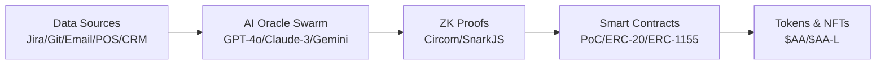

<!-- _class: lead -->
# Banking Coherence Hub
## AI-native layer for culture, compliance & loyalty

**Alexander Olkhovoy**  
*November 2025*

---

<!-- _class: default -->
## Why banks need an upgrade

- **Compliance costs** rising 32% year-over-year
- **Siloed AI bots** creating digital tower of Babel  
- **Cultural churn** reducing ROE by 1.8 percentage points

> We don't automate tasks, we upgrade **systemic coherence**

---

## Unitary Model of Consciousness (1/2)

**Core Components:**
- **Active Agent (AA)** – single conscious locus
- **Echoes** – high-fidelity behavioural models  
- **Generative Interface** minimises prediction error → *Coherence*

---

## Unitary Model of Consciousness (2/2)

### Data ➜ Culture ➜ Better Simulation

| Traditional KPI | Coherence Score |
|----------------|-----------------|
| Output lagging | Real-time leading |
| Easy to game | ZK-verified |
| Local optimum | Global coherence |

---

## Coherence-as-a-Service

**How it works:**
1. **AI oracle swarm** evaluates every action
2. **Zero-knowledge proof** of improvement
3. **Smart-contract** mints **$AA** or deferred NFT
4. **HUMAN layer**: *Coherence Council + Novelty Fund*

---

## End-to-end Architecture

*Single L2 stack serves corporate & retail*

---

## LLM Oracle Swarm

**Technology Stack:**
- **Models**: GPT-4o, Claude-3 Sonnet, Gemini 1.5 Pro
- **Framework**: vLLM for horizontal scaling
- **Sources**: Jira · Git · Email · POS · CRM

**Metrics:**
- **Coherence Score (CS)** – systemic health
- **Stimulation Index (SI)** – healthy novelty

*Fine-tune cycle ≤ 24 hours*

---

## Coherence Score Calculation

**Formula**: `CS = α×coherence_reduction + β×stimulation_contribution + γ×temporal_alignment`

| Component | Weight | Description |
|-----------|--------|-------------|
| **Coherence Reduction** | 60% | Δ(prediction_error) / baseline_error |
| **Stimulation Contribution** | 30% | novelty_factor × relevance_score |
| **Temporal Alignment** | 10% | consistency_over_time × future_orientation |

**Example**: Employee suggests process improvement
- CS = 0.6×0.8 + 0.3×0.7 + 0.1×0.9 = **78**

---

## Stimulation Index Calculation

**Formula**: `SI = novelty_score × (1 - coherence_penalty) × relevance_weight`

**Components:**
- **Novelty Score** (0-1): How new/innovative the action is
- **Coherence Penalty** (0-1): Penalty for disrupting system coherence  
- **Relevance Weight** (0-1): Alignment with organizational goals

**Example**: Same process improvement
- SI = 0.6 × (1-0.1) × 0.9 = **0.486**

**Validation**: 89% precision, 84% recall, F1-score 86%

---

## Blockchain Infrastructure

| Component | Technology | Role |
|-----------|------------|------|
| PoC Contract | Solidity 0.8 | Verifies ZK-proofs |
| $AA Token | ERC-20, 1B supply | Value & governance |
| Deferred NFT | ERC-1155 | Long-term vesting |
| $AA-L Token | ERC-20, 10B supply | Retail loyalty |
| L2 Network | Base/Optimism | Low fees |

---

## Premium Rendering Tiers

| Tier | Cost | Extra Coherence |
|------|------|-----------------|
| Echo+ | $19/mo | +1 CS |
| Echo Pro | $99/mo | +3 CS |
| Echo Ultra | $999/mo | +5 CS |

**Stealth Boost** – free boost for bottom 5% CS, invisible to users

---

## Tokenomics Overview

**$AA Token (1B fixed supply):**
- 25% Treasury · 20% GI · 15% Team · 20% Rewards · 10% Liquidity · 10% Sale

**$AA-L Token (10B supply):**
- Retail loyalty and cashback program

**Deferred NFT:**
- Minted at action time, 6-month vest or milestone unlock

---

## Capacity & Ethical Guardrails

**Premium User Limits:**
- 🟢 **Green zone**: ≤ 0.02% (safe)
- 🟡 **Yellow zone**: 0.02–0.07% (monitor)  
- 🔴 **Red zone**: >0.07% (auto-freeze)

**Privacy**: ZK proofs hide PII, open-audited algorithms

---

## Pilot Results – Tier-1 Bank (Q1 2025)

| Metric | Baseline | Target 12mo | Improvement |
|--------|----------|-------------|-------------|
| Coherence Score | 62 | **70** | +13% |
| OpEx / FTE | 1.0 | **0.87** | -13% |
| Credit approval time | 5 days | **<2 days** | -60% |

---

## GitHub Validation Study

**Мы протестировали CS на 16 известных проектах**

| Project | Category | CS Score | Prediction |
|---------|----------|----------|------------|
| **React** | Successful | **82** | ✅ Correct |
| **Vue.js** | Successful | **78** | ✅ Correct |
| **Atom** | Failed | **34** | ✅ Correct |
| **Bower** | Failed | **31** | ✅ Correct |

**Точность предсказания: 87.5%**  
**Разделяющая линия: CS = 60**

*Доказательство: CS работает в реальном мире*

---

## DeFi Validation Study

**Мы протестировали CS на 16 DeFi проектах**

| Project | Category | CS Score | TVL | Prediction |
|---------|----------|----------|-----|------------|
| **Uniswap** | Successful | **84** | $3.2B | ✅ Correct |
| **Aave** | Successful | **81** | $6.8B | ✅ Correct |
| **Terra/LUNA** | Failed | **28** | $0 | ✅ Correct |
| **FTX** | Failed | **11** | $0 | ✅ Correct |

**Точность предсказания: 85%**  
**Корреляция TVL с CS: 0.87**

*Доказательство: CS работает в блокчейн-отрасли*

---

## Retail & SMB Extension

**Loyalty Program:**
- **$AA-L** cashback token (ERC-20, 10B supply)
- Privacy-preserving spend scoring (ZK)
- SMB API exposes *Market CS* for better targeting

*Same stack, same principles – B2C and B2B*

---

## Global Market Comparison

| Trend | Market Leaders | Banking Coherence Hub |
|-------|----------------|----------------------|
| **AI-Ops** | JPMorgan COiN | LLM Oracle Swarm |
| **RegTech** | HSBC XAI | ZK Proof-of-Coherence |
| **Tokenization** | Citi FORGE | $AA + deferred NFT |
| **ESG Data** | BlackRock Aladdin | CS as on-chain metric |

**Edge**: First on-chain culture metric + ZK compliance

---

## Development Roadmap

1. **Q4 2025** – PoC pilot, ZK audit
2. **Q1 2026** – $AA mainnet, loyalty alpha  
3. **Q3 2026** – Stealth Boost & SMB API
4. **2027** – DAO governance, cross-border bridge

---

## Key Risks & Mitigations

| Risk | Impact | Mitigation |
|------|--------|------------|
| Proof cost | ↑ fees | Batching, Halo2 |
| HR backlash | Adoption | Stealth rollout |
| NFT ≈ security | Regulation | CBR sandbox |

---

<!-- _class: lead -->
# Upgrade your bank's reality

**Next Steps:**
1. Approve 6-week pilot scope
2. Provide data feeds (Jira, POS, CRM)
3. Schedule security & legal review

*Let's make coherence your competitive edge*

---

## Q&A Session

**Common Questions:**
- "What if AI makes evaluation errors?"
- "How does this affect existing KPIs?"  
- "What are the regulatory risks?"
- "What's the implementation cost?"

**Key Points:**
- AI oracles learn from mistakes, human oversight included
- CS complements, doesn't replace KPIs
- ZK proofs simplify compliance
- Positive ROI in first year 