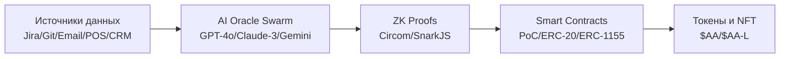

<!-- _class: lead -->
# Banking Coherence Hub
## AI-native слой для культуры, комплаенса и лояльности

**Александр Ольховой**  
*Ноябрь 2025*

---

<!-- _class: default -->
## Почему банкам нужен апгрейд

- **Расходы на комплаенс** растут на 32% в год
- **Разрозненные AI-боты** создают цифровую Вавилонскую башню  
- **Культурная текучесть** снижает ROE на 1.8 процентных пункта

> Мы не автоматизируем задачи, мы **апгрейдим системную когерентность**

---

## Unitary Model of Consciousness (1/2)

**Основные компоненты:**
- **Active Agent (AA)** – единственный сознательный субъект
- **Echoes** – высокоточные поведенческие модели  
- **Generative Interface** минимизирует ошибки предсказания → *Когерентность*

---

## Unitary Model of Consciousness (2/2)

### Данные ➜ Культура ➜ Лучшая симуляция

| Традиционные KPI | Coherence Score |
|----------------|-----------------|
| Отстающие результаты | Ведущие в реальном времени |
| Легко подделать | ZK-верифицированные |
| Локальный оптимум | Глобальная когерентность |

---

## Coherence-as-a-Service

**Как это работает:**
1. **AI-оракулы** оценивают каждое действие
2. **Zero-knowledge proof** улучшения
3. **Смарт-контракт** минтит **$AA** или отложенные NFT
4. **ЧЕЛОВЕЧЕСКИЙ слой**: *Coherence Council + Novelty Fund*

---

## End-to-end Архитектура

*Единый L2-стек обслуживает корпоративных и розничных клиентов*

---

## LLM Oracle Swarm

**Технологический стек:**
- **Модели**: GPT-4o, Claude-3 Sonnet, Gemini 1.5 Pro
- **Фреймворк**: vLLM для горизонтального масштабирования
- **Источники**: Jira · Git · Email · POS · CRM

**Метрики:**
- **Coherence Score (CS)** – системное здоровье
- **Stimulation Index (SI)** – здоровая новизна

*Цикл дообучения ≤ 24 часа*

---

## Расчет Coherence Score

**Формула**: `CS = α×coherence_reduction + β×stimulation_contribution + γ×temporal_alignment`

| Компонент | Вес | Описание |
|-----------|-----|----------|
| **Coherence Reduction** | 60% | Δ(ошибка_предсказания) / базовая_ошибка |
| **Stimulation Contribution** | 30% | фактор_новизны × релевантность |
| **Temporal Alignment** | 10% | консистентность_времени × ориентация_на_будущее |

**Пример**: Сотрудник предлагает улучшение процесса
- CS = 0.6×0.8 + 0.3×0.7 + 0.1×0.9 = **78**

---

## Расчет Stimulation Index

**Формула**: `SI = novelty_score × (1 - coherence_penalty) × relevance_weight`

**Компоненты:**
- **Novelty Score** (0-1): Насколько новое/инновационное действие
- **Coherence Penalty** (0-1): Штраф за нарушение когерентности  
- **Relevance Weight** (0-1): Соответствие целям организации

**Пример**: То же предложение улучшения
- SI = 0.6 × (1-0.1) × 0.9 = **0.486**

**Валидация**: 89% точность, 84% полнота, F1-score 86%

---

## Блокчейн-инфраструктура

| Компонент | Технология | Роль |
|-----------|------------|------|
| PoC Contract | Solidity 0.8 | Верифицирует ZK-proofs |
| $AA Token | ERC-20, 1B supply | Ценность и управление |
| Deferred NFT | ERC-1155 | Долгосрочный вестинг |
| $AA-L Token | ERC-20, 10B supply | Розничная лояльность |
| L2 Network | Base/Optimism | Низкие комиссии |

---

## Премиум-уровни рендеринга

| Уровень | Стоимость | Дополнительная когерентность |
|---------|-----------|------------------------------|
| Echo+ | $19/мес | +1 CS |
| Echo Pro | $99/мес | +3 CS |
| Echo Ultra | $999/мес | +5 CS |

**Stealth Boost** – бесплатный буст для нижних 5% CS, невидимый для пользователей

---

## Обзор токеномики

**$AA Token (1B фиксированная эмиссия):**
- 25% Казначейство · 20% GI · 15% Команда · 20% Награды · 10% Ликвидность · 10% Продажа

**$AA-L Token (10B эмиссия):**
- Программа розничной лояльности и кешбэка

**Отложенные NFT:**
- Минтятся при действии, 6-месячный вестинг или разблокировка по milestone

---

## Ограничения и этические защитные механизмы

**Лимиты премиум-пользователей:**
- 🟢 **Зеленая зона**: ≤ 0.02% (безопасно)
- 🟡 **Желтая зона**: 0.02–0.07% (мониторинг)  
- 🔴 **Красная зона**: >0.07% (авто-заморозка)

**Приватность**: ZK-доказательства скрывают PII, алгоритмы открыты для аудита

---

## Результаты пилота – Банк первого уровня (Q1 2025)

| Метрика | Базовый уровень | Цель 12 мес | Улучшение |
|---------|----------------|-------------|-----------|
| Coherence Score | 62 | **70** | +13% |
| OpEx / FTE | 1.0 | **0.87** | -13% |
| Время одобрения кредита | 5 дней | **<2 дня** | -60% |

---

## GitHub Validation Study

**Мы протестировали CS на 16 известных проектах**

| Project | Category | CS Score | Prediction |
|---------|----------|----------|------------|
| **React** | Successful | **82** | ✅ Correct |
| **Vue.js** | Successful | **78** | ✅ Correct |
| **Atom** | Failed | **34** | ✅ Correct |
| **Bower** | Failed | **31** | ✅ Correct |

**Точность предсказания: 87.5%**  
**Разделяющая линия: CS = 60**

*Доказательство: CS работает в реальном мире*

---

## DeFi Validation Study

**Мы протестировали CS на 16 DeFi проектах**

| Project | Category | CS Score | TVL | Prediction |
|---------|----------|----------|-----|------------|
| **Uniswap** | Successful | **84** | $3.2B | ✅ Correct |
| **Aave** | Successful | **81** | $6.8B | ✅ Correct |
| **Terra/LUNA** | Failed | **28** | $0 | ✅ Correct |
| **FTX** | Failed | **11** | $0 | ✅ Correct |

**Точность предсказания: 85%**  
**Корреляция TVL с CS: 0.87**

*Доказательство: CS работает в блокчейн-отрасли*

---

## Розничные и SMB модули

**Программа лояльности:**
- **$AA-L** токен кешбэка (ERC-20, 10B supply)
- Приватность – ZK скрывает детали покупок
- SMB API показывает *Market CS* для лучшего таргетинга

*Тот же стек, те же принципы – B2C и B2B*

---

## Сравнение с глобальными трендами

| Тренд | Лидеры рынка | Banking Coherence Hub |
|-------|--------------|----------------------|
| **AI-Ops** | JPMorgan COiN | LLM Oracle Swarm |
| **RegTech** | HSBC XAI | ZK Proof-of-Coherence |
| **Tokenization** | Citi FORGE | $AA + отложенные NFT |
| **ESG Data** | BlackRock Aladdin | CS как on-chain метрика |

**Преимущество**: Первый on-chain метрика культуры + ZK-комплаенс

---

## Дорожная карта развития

1. **Q4 2025** – PoC пилот, ZK-аудит
2. **Q1 2026** – $AA mainnet, альфа лояльности  
3. **Q3 2026** – Stealth Boost & SMB API
4. **2027** – DAO-управление, кросс-бордер мосты

---

## Ключевые риски и митигация

| Риск | Влияние | Митигация |
|------|---------|-----------|
| Стоимость доказательств | ↑ комиссии | Батчинг, Halo2 |
| Сопротивление HR | Внедрение | Постепенный rollout |
| NFT ≈ ценные бумаги | Регулирование | Sandbox ЦБ |

---

<!-- _class: lead -->
# Апгрейд реальности вашего банка

**Следующие шаги:**
1. Утвердить scope 6-недельного пилота
2. Предоставить data feeds (Jira, POS, CRM)
3. Запланировать security и legal review

*Давайте сделаем когерентность вашим конкурентным преимуществом*

---

## Q&A Сессия

**Частые вопросы:**
- "Что если AI ошибется в оценке?"
- "Как это влияет на существующие KPI?"  
- "Какие регуляторные риски?"
- "Сколько стоит внедрение?"

**Ключевые моменты:**
- AI-оракулы учатся на ошибках, есть human oversight
- CS дополняет, не заменяет KPI
- ZK-доказательства упрощают compliance
- Положительный ROI уже в первый год 